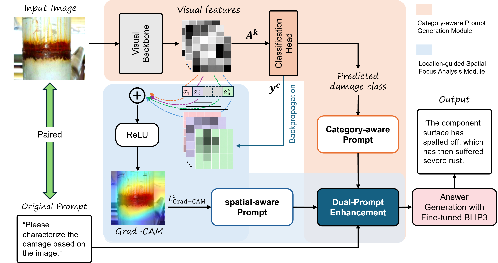

# DamageCap



This repository contains the code and documentation for our team's entry in **Project 3 of the 4th International Competition for Structural Health Monitoring (IC-SHM 2026)**.

# Table of Contents

- [Installation](#installation)
- [Usage](#usage)
  - [Data Preparation](#data-preparation)
  - [Model Preparation](#model-preparation)
  - [Inference](#inference)
- [Training](#training)
  - [Data Annotation Preparation](#data-annotation-preparation)
  - [Classifier Training](#classifier-training)
  - [BLIP-3 LoRA Fine-tuning](#blip-3-lora-fine-tuning)
- [Contact](#contact)

# Installation

We recommend installing the environment in the following order:

Create a Conda environment and install PyTorch

```bash
conda create -n damagecap python=3.10 -y
conda activate damagecap

pip install torch==2.2.1 torchvision==0.17.1
```

To install training or infer dependencies, run one of the following two commands
```
pip install -r requirements_train.txt
pip install -r requirements.txt
```

Install the customized OpenFlamingo library:

```bash
pip install -e . --no-deps
```

# Usage

## 📂 Data Preparation
Please download the dataset from the link below. The training data are based on the official IC-SHM 2026 Project 3 training set. We additionally include non-damage samples and horizontally flipped augmentation for selected crack images.

| Dataset          | Usage             | Source                                                                   |
|------------------|-------------------|--------------------------------------------------------------------------|
| ICSHM   Project3 | Train & Inference | [Google Drive](https://drive.google.com/file/d/1gzm2ABiHPQGopLn-dt8tHbEzeqWvWWad/view?usp=sharing) |

After downloading and extracting the dataset, place it under the `dataset/` directory:

```text
DamageCap/
├── dataset/
│   ├── image/              # training images
│   ├── icshm_test/         # test images
│   └── description.json
```

## 📊 Model Preparation

Please download the pretrained classifier checkpoints and the fine-tuned BLIP3 checkpoints from:

🔗 [Google Drive](https://drive.google.com/file/d/1qWTKCYKCWVodcnJgHew8hmXY1VEExga2/view?usp=sharing)

and place it to your DamageCap project:
```
DamageCap/
├── resnet50_classification/
│   └── runs/             
│       └── resnet50_eca_official/ 

├── checkpoints/
│   └── finetune-xgenmmv1-phi3-lora-defect/              
```

## 🚀 Inference

To reproduce the results for IC-SHM 2026 project 3, run (Please update all the `your/path/` in `run_infer.sh` to match your local environment):
```bash
bash run_infer.sh
```

# Training

Training DamageCap consists of two stages: (1) training the structural damage classifier and (2) LoRA fine-tuning BLIP-3.

## Data Annotation Preparation

The annotations are already provided in the repository.


## Classifier Training

The classifier uses an attention-enhanced ResNet-50. Please download the pre-trained weight before training: [Google Drive](https://drive.google.com/file/d/1inHDZXua1Pjc_kLod3khTDHbB8QhQ_VY/view?usp=sharing), and place it 
in `resnet50_classification/pretrained/`.

Then enter `resnet50_classification/` and run (Please update all the `your/path/` in `run_infer.sh` to match your local environment):

```bash
bash run_train.sh eca_official
```

The best classifier checkpoint is saved as `best_metric.pt` in the configured output directory. When using the newly trained classifier for inference, update `--resnet-checkpoint` in `run_infer.sh` accordingly.

## BLIP-3 LoRA Fine-tuning

Return to `DamageCap/` and using the following command to launch fine-tuning with 2 GPUs (Please update all the `your/path/` in `run_infer.sh` to match your local environment):
```bash
bash run_finetune_xgenmmv1_phi3_lora.sh
```

Compact checkpoints are saved after each epoch in the experiment directory.

# Contact

For questions or issues, please contact [mingyang.ren@student.uts.edu.au](mailto:mingyang.ren@student.uts.edu.au).
